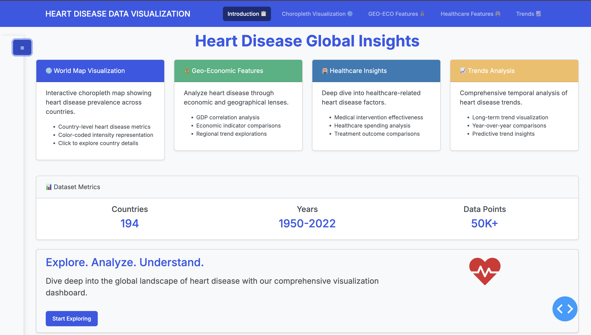
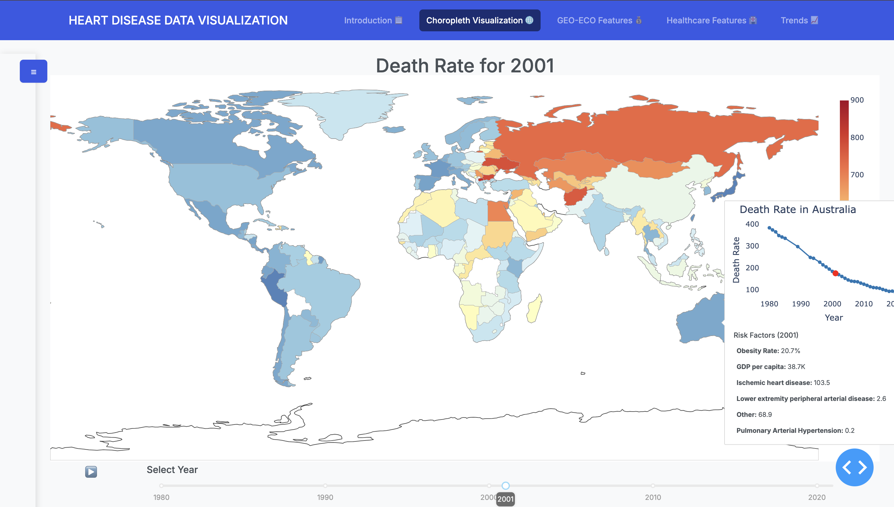
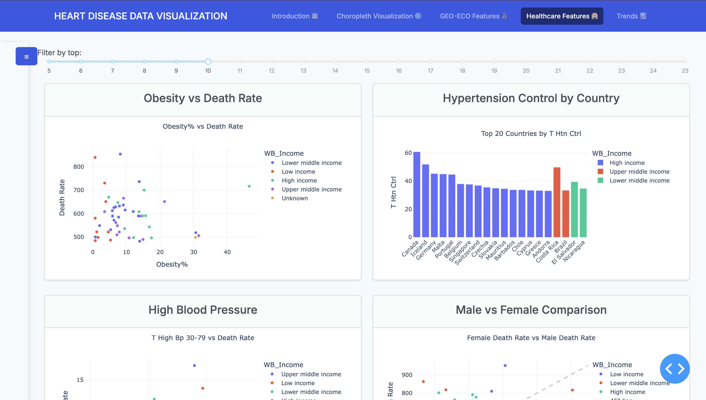

# Heart Disease Data Visualization Dashboard

An interactive dashboard built with Dash and Plotly for visualizing global heart disease data trends and patterns. The project is deployed using Google Cloud Platform and features a modular, responsive design with interactive visualizations.

## Table of Contents

- [Overview](#overview)
- [Features](#features)
- [Project Structure](#project-structure)
- [Installation](#installation)
- [Usage](#usage)
- [Data Processing](#data-processing)
- [Dashboard Overview](#dashboard-overview)
- [Technical Details](#technical-details)
- [Deployment](#deployment)
- [Development Guidelines](#development-guidelines)
- [Acknowledgments](#acknowledgments)

---

## Overview

This dashboard provides an interactive way to explore heart disease data worldwide. It allows users to analyze trends, compare regions, and understand the impact of economic and healthcare factors on cardiovascular disease.

## Features

- **Interactive Visualizations**: Choropleth maps, line charts, scatter plots, and Sankey diagrams
- **Responsive Design**: Optimized for small and large screens using Bootstrap
- **Dynamic Filtering**: Sliders for year selection and top N filtering
- **Modular Codebase**: Organized for scalability and ease of maintenance
- **AWS Deployment**: Hosted on AWS Elastic Beanstalk with Flask

## Project Structure

```
heart-disease/
├── application.py        # Main application entry point
├── components/
│   ├── common/          # Shared components
│   │   ├── filter_slider.py
│   │   ├── gender_metric_selector.py
│   │   ├── plots.py
│   │   └── year_slider.py
│   ├── data/            # Data handling components
│   │   └── data.py         # Data processing and management
│   ├── tabs/            # Tab-specific components
│   │   ├── geo_eco.py       # Geographic and economic analysis
│   │   ├── healthcare.py    # Healthcare metrics visualization
│   │   ├── introduction.py  # Dashboard introduction
│   │   ├── trends.py        # Time series analysis
│   │   └── world_map.py     # World map visualization
│   ├── sidebar.py       # Sidebar component
│   └── visualisations.py # Visualization utilities
├── data/                # Data files
│   ├── cleaning_and_merging.py  # Data processing script
│   ├── data_dictionary.csv      # Data field descriptions
│   ├── data_dictionary.md       # Detailed data documentation
│   ├── heart_processed.csv      # Processed heart disease data
│   └── trends.csv              # Time series data
├── documentation/       # Project documentation
├── .ebextensions/       # AWS Elastic Beanstalk configuration
├── .platform/          # Platform configuration
├── Pipfile             # Dependencies management
├── Pipfile.lock        # Locked dependencies
├── pyproject.toml      # Project configuration
└── runtime.txt         # Python runtime specification
```

## Installation

### Prerequisites

- Python 3.8+
- Pipenv for dependency management

### Steps

1. Clone the repository:
   ```bash
   git clone https://github.com/DerekAmuna/heart-disease.git
   cd heart-disease
   ```
2. Install dependencies:
   ```bash
   pipenv install
   ```
3. Run the application locally:
   ```bash
   python application.py
   ```
4. Open your browser and visit `http://0.0.0.0:8080/`

## Usage

The dashboard consists of multiple interactive tabs:

1. **World Map**: Displays heart disease prevalence using a choropleth map.
2. **Geo-Eco Analysis**: Analyzes economic indicators and regional comparisons.
3. **Healthcare Metrics**: Visualizes healthcare facilities and accessibility.
4. **Trends**: Shows time-series trends and comparative statistics.

## Data Processing

### Data Processing Steps

1. **Data Loading**
   - Loads base dataset from cardiovascular death rate vs GDP per capita
   - Merges additional datasets from Our World in Data
   - Incorporates IHME GBD data

2. **Data Cleaning**
   - Standardizes country names using a mapping dictionary
   - Handles missing values through interpolation and imputation
   - Normalizes column names for consistency

3. **Data Transformation**
   - Pivots data for deaths and prevalence by gender
   - Creates standardized metrics for death rates and prevalence
   - Combines regional and global statistics

4. **Output**
   - Produces a comprehensive CSV file with merged data
   - Includes population data for normalization
   - Maintains consistent column naming for easy analysis

### Running the Pipeline

```bash
python3 cleaning_and_merging.py
```

The script will process all data sources and output a file named `heart_processed.csv` in the parent directory.

### Data Dictionary

Key columns in the output dataset:

- `Entity`: Country or region name
- `Year`: Data year
- `deaths_total`: Total deaths from cardiovascular diseases
- `deaths_female/male`: Gender-specific death counts
- `prev_total`: Total disease prevalence
- `prev_female/male`: Gender-specific prevalence
- Additional metrics for death rates, risk factors, and healthcare indicators

## Dashboard Overview






## Technical Details

### Core Components

#### Sidebar (`components/sidebar.py`)

- Collapsible design with smooth transitions
- Responsive width adjustments
- Dynamic state management with Dash callbacks

#### Year Slider (`components/common/year_slider.py`)

- Interactive slider (1950-2023) with play/pause animation
- Dynamic year updates

#### Choropleth Map (`components/tabs/world_map.py`)

- Interactive world map visualizing heart disease prevalence
- Optimized for fast rendering and smooth interaction

#### Plot Layout (`components/common/plots.py`)

- Grid-based responsive design using Bootstrap
- Efficient space utilization with viewport-based sizing

### Callback Structure

#### Navigation Callbacks

```python
@app.callback(
    [Output(f"tab-{i}-link", "active") for i in range(1, 5)],
    [Input(f"tab-{i}-link", "n_clicks") for i in range(1, 5)]
)
```

- Manages tab activation states dynamically

#### Animation Callbacks

```python
@callback(
    Output("animation-interval", "disabled"),
    Output("play-button", "children"),
    Input("play-button", "n_clicks"),
    State("animation-interval", "disabled"),
)
```

- Controls animation states for year selection

  ```

### Environment Variables

- `PORT`: Web server port configuration
- `DEBUG`: Toggle debug mode
- `GCP`: Google Cloud Platform

## Development Guidelines

### Adding New Features

1. Create a new component in the appropriate directory.
2. Implement necessary callbacks.
3. Update the main application to include the new feature.
4. Document the changes.

### Code Style

- Follow PEP 8 guidelines.
- Use meaningful variable names.
- Include docstrings for complex functions.
- Maintain consistent formatting.

### Testing

- Validate callback functionality.
- Ensure responsive design across devices.
- Optimize performance for smooth user experience.

## Acknowledgments

- **Data Sources**: WHO, IHME, World Bank
- **Libraries Used**: Dash, Plotly, Pandas, Bootstrap, Flask
- **Hosting**: Google Cloud Platform
